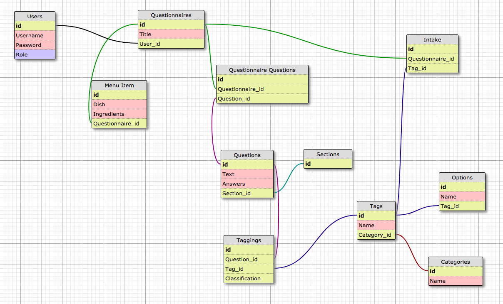

# Outbreak READY
The frontend repository for this project can be found [here](https://github.com/corneliusellen/outbreak).

## Schema



## Available Requests

#### Questionnaire CRUD Endpoints
* ```GET /api/v1/questionnaires``` Returns all questionnaires.
* ```POST /api/v1/questionnaires``` Creates a questionnaire.
* ```GET /api/v1/questionnaires/:id``` Returns single questionnaire.
* ```PUT /api/v1/questionnaires/:id``` Updates a questionnaire.
* ```DELETE /api/v1/questionnaires/:id``` Deletes a questionnaire.
#### Intake Endpoint
* ```GET /api/v1/questionnaires/:questionnaire_id/intakes``` Creates intake information for associated questionnaire.
#### Questions Endpoints
* ```GET /api/v1/questionnaires/:questionnaire_id/demographics``` Sends demographic questions for associated questionnaire.
* ```GET /api/v1/questionnaires/:questionnaire_id/clinicals``` Sends clinical questions for associated questionnaire.
* ```GET /api/v1/questionnaires/:questionnaire_id/exposures``` Sends exposure questions for associated questionnaire.
* ```GET /api/v1/questionnaires/:questionnaire_id/questions``` Sends selected questions for associated questionnaire.
* ```POST /api/v1/questionnaires/:questionnaire_id/foods``` Creates Menu Items for associated questionnaire specified in header.
* ```GET /api/v1/questionnaires/:questionnaire_id/foods``` Sends Menu Items for associated questionnaire specified in header.
#### Tags Endpoint
* ```GET /api/v1/tags``` Sends all tags.
#### Restaurant Search Enpoints
* ``` GET /api/v1/search/restaurants``` Sends all restaurants for given search criteria in parameters.
* ``` GET /api/v1/search/menus``` Sends all menus for given restaurant specfifed in parameters.

## Author
Ellen Cornelius. Check out my website at [ellencornelius.com](https://www.ellencornelius.com/).
